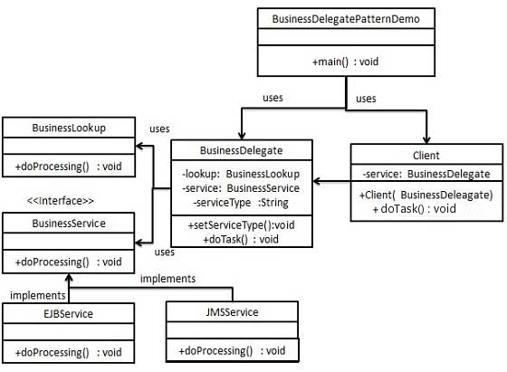
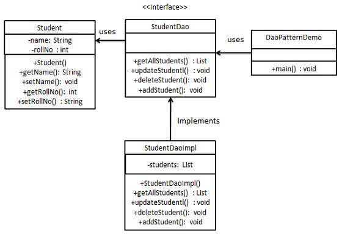

#J2EE模式

这些设计模式特别关注表示层，这些模式是由Sun Java Center鉴定的。
* MVC模式（MVC Pattern）
* 业务代表模式（Business Delegate Pattern）
* 组合实体模式（Composite Entity Pattern）
* 数据访问对象模式（Data Access Object Pattern）
* 前端控制器模式（Front Controller Pattern）
* 拦截过滤器模式（Intercepting Filter Pattern）
* 服务定位器模式（Service Locator Pattern）
* 传输对象模式（Transfer Object Pattern）

### 1、MVC模式
  MVC模式代表Model-View-Controller(模型-视图-控制器)模式。这种模式用于应用程序的分层开发。
  * Model（模型）-模型代表一个存取数据的对象或Java POJO。它也可以带有逻辑，在数据变化时更新控制器。
  * View（视图）-视图代表模型包含的数据的可视化。
  * Controller（控制器） -控制器作用在模型和视图上。它控制数据流向模型对象，并在数据变化时更新视图。它使视图和模型分离开。
  
### 2、业务代表模式（Business Delegate Pattern）
  业务代表模式（Business Delegate Pattern）用于对表示层和业务层解耦。它基本上用来减少通信或对表示层中的业务代码的远程查询功能。
  在业务层中我们有以下实体。
  * 客户端（Client） - 表示层代码可以是JSP、servlet或UI java代码。
  * 业务代表（Business Delegate） - 一个为客户端实体提供的入口类。它提供了对业务服务方法的访问。
  * 查询服务（LookUp Service） - 查询服务对象负责获取相关的业务实现，并提供业务对象对业务代表对象的访问。
  * 业务服务（Business Service） - 业务服务接口。实现了该业务服务的实体类，提供了实际的业务实现逻辑。
  
##### 实现：
  创建Client、BusinessDelegate、BusinessService、LookUpService、JMSService和EJBService来表示业务代表模式中的各种实体。
  BusinessDelegatePatternDemo，演示类使用BusinessDelegate和Client来演示业务代表模式的用法。
  
 
### 3、组合实体模式（Composite Entity Pattern）
  组合实体模式（Composite Entity Pattern）用在EJB持久化机制中。一个组合实体就是一个EJB实体Bean，代表了对象的图解。当更新一个
  组合实体时，内部依赖对象Beans就会自动更新，因为它们是由EJB实体bean管理的。一下是组合实体的参与者。
  * 组合实体（Composite Entity） - 它是主要的实体bean，它可以是粗粒度的，或者可以是包含一个粗粒度对象，用于持续生命周期。
  * 粗粒度对象（Coares-Grained Object） -该对象包含依赖对象。它有自己的生命周期，也能管理依赖的生命周期。
  * 依赖对象（Dependent Object） - 依赖对象是一个持续生命周期依赖于粗粒度对象的对象。
  * 策略（Strategies）- 策略表示如何实现组合实体。
  
##### 实现：
  创建 作为组合实体的CompositeEntity对象。CoatsGrainedObject是一个包含依赖对象的类。CompositeEntityPatternDemo,演示类使用
  Client类来演示组合实体模式的用法。
  
  
### 4、数据访问对象模式（Data Access Object Pattern）
  数据访问对象模式（Data Access Object Pattern）或DAO模式用于把低级的数据访问API或操作从高级的业务服务中分离出来。
  以下是数据访问对象模式的参与者。
  * 数据访问对象接口（Data Access Object Interface） - 该接口定义了在一个模型对象上要执行的标准操作。
  * 数据访问对象实体类（Data Access Object concrete class） -该类实现了上述接口。该类负责从数据源获取数据，数据源可以是数据库，也可以是xml，或者是其他存储机制。
  * 模型对象/数值对象（Model Object/Value Object） - 该对象是简单的POJO，包含get/set方法老存储通过DAO类检索到的数据。
  
 ##### 实现：
 创建一个作为模型对象或数值对象的Student对象。StudentDao是数据访问对象接口。StudentDaoImpl是实现了数据访问对象的接口的实体类。
 DaoPatternDemo,演示类使用StudentDao来演示数据访问对象模式的用法。
 
 
### 5、前端控制器模式（Front Controller Pattern）
  前端控制器模式（Front Controller Pattern）是用来提供一个集中的请求处理机制，所有的请求都将由一个单一的处理程序处理。该程序可以做认证/授权/记录日志，或者跟踪请求，
  然后把请求传给相应的处理程序。以下看这种设计模式的实体：
  * 前端控制器（Front Controller）- 处理应用所有类型请求的单个处理程序，应用程序可以是基于web的应用程序，也可以是基于桌面的应用程序。
  * 调度器（Dispatcher）- 前端控制器可能使用一个调度器对象来调度请求到相应的具体处理程序。
  * 视图（View） - 视图是为请求而创建的对象。
 ##### 实现：
 我们将创建FrontController、Dispatcher分别当作前端控制器和调度器。HomeView和StudentView表示各种为前端控制器接收到的请求而创建的视图。
 FrontControllerPatternDemo演示类，使用FrontController来演示前端控制器设计模式。
 