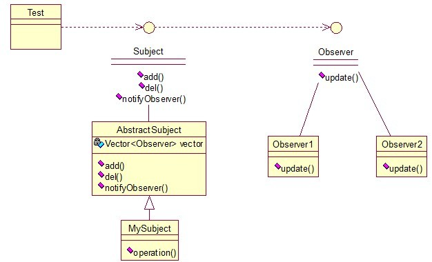
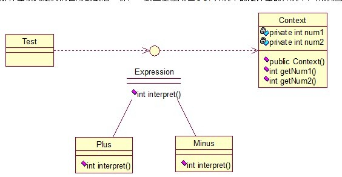

#Java开发中的23中设计模式

##一、设计模式的分类
总体分为三大类：
	
    - 创建性模式，共五种：工厂方法模式、抽象工厂模式、单利模式、创造者模式、原型模式
	- 结构型模式，共七种：适配器模式、装饰器模式、代理模式、外观模式、桥接模式、组合模式、享元模式
	- 行为模式，共十一种：策略模式、模板方法模式、观察者模式、迭代子模式、责任链模式、命令模式、备忘录模式、状态模式、访问者模式、中介者模式、解释器模式
 - 其实还有两类：并发型模式和线程池模式
 
##二、设计模式的六大原则
#####  1、开闭原则（Open Close Principle）
- 开闭原则就是说对扩展开发，对修改关闭。在程序需要进行扩展的时候，不能去修改原有的代码，实现一个热插拔的效果。所以一句话概括就是：为了是程序的扩展性好，易于维护和升级。想要达到这样的效果，需要使用接口和抽象类。

##### 2、里氏代换原则（Liskov Substitution Principle）
- 里氏代换原则（Liskov SubStitution Priciple LSP）面向对象设计的基本原则之一。里氏代换原则中说，任何基类可以出现的地方，子类一定可以出现。LSP是继承复用的基石，只有当衍生类可以替换掉基类，软件单位的功能不受到影响时，基类才能真正被复用，而衍生类也能够在基类的基础上增加新的行为。里氏代换原则是对“开-闭”原则的补充。实现“开-闭”原则的关键步骤就是抽象化。而基类与子类的继承关系就是抽象化的具体实现，所以里氏代换原则是对实现抽象化的具体步骤的规范。—— From Baidu 百科

#####  3、依赖倒转原则（Dependence Inversion Principle）
- 这个是开闭原则的基础，具体内容：真对接口编程，依赖于抽象而不依赖于具体

#####  4、接口隔离原则（Interface Segregation Principle）
- 这个原则的意思是：使用多个隔离的接口，比使用单个接口要好。还是一个降低类之间的耦合度的意思，从这儿我们看出，其实设计模式就是一个软件的设计思想，从大型软件架构出发，为了升级和维护方便。所以上文中多次出现：降低依赖，降低耦合。

#####  5、迪米特法则（最少知道原则）（Demeter Principle）
- 为什么叫最少知道原则，就是说：一个实体应当尽量少的与其他实体之间发生相互作用，使得系统功能模块相对独立。

#####  6、合成复用原则（Composite Reuse Principle）
- 原则是尽量使用合成/聚合的方式，而不是使用继承。如果要使用继承关系，则必须严格遵循里氏替代原则。合成复用原则同里氏替代原则相辅相成，两者都是开闭原则的具体实现规范。

##三、模式详解

### 一 · 创建型模式

#####1、单利模式（Singleton）
- 单例对象（Singleton）是一种常用的设计模式。在Java应用中，单例对象能保证在一个JVM中，该对象只有一个实例存在。

先看一个简单的例子

```java
package org.design.pattern.singleton;

public class Singleton01 {
	
	/* 持有私有静态实例，防止被引用，此处 赋值为null，目的是实现延迟加载*/
	private static Singleton01 instance = null;
	
	/* 私有构造方法，防止被实例化 */
	private Singleton01() {
	}
	
	/*静态工程方法，创建实例*/
	public static Singleton01 getInstance() {
		if(instance == null) {
			instance = new Singleton01();
		}
		return instance;
	}
	
	/*如果该对象被用于序列化，可以保证对象在序列化前后保持一致*/
	public Object readResolve() {
		return instance;
	}
}
```
这个类可以满足基本要求，但是，像这样毫无线程安全保护的类，如果我们把它放入多线程的环境下，肯定就会出现问题了，如何解决？我们首先会想到对getInstance方法加synchronized关键字，如下：

```java
	public static synchronized Singleton01 getInstance01() {
		if(instance == null) {
			instance = new Singleton01();
		}
		return instance;
	}
```
synchronized关键字锁住的是这个对象，这样的用法，在性能上会有所下降，因为每次调用getInstance()，
都要对对象上锁，事实上，只有在第一次创建对象的时候需要加锁，之后就不需要了，所以，这个地方需要改进。

```java
	public static Singleton01 getInstance02() {
		if(instance == null) {
			synchronized (instance) {
				instance = new Singleton01();
			}
		}
		return instance;
	}
```
 似乎解决了之前提到的问题，将synchronized关键字加在了内部，也就是说当调用的时候是不需要加锁的，
只有在instance为null，并创建对象的时候才需要加锁，性能有一定的提升。但是这种情况还是可能有问题。
在Java指令中创建对象和赋值操作是分开进行的，但是JVM不能保证这两个操作的先后顺序，也就是说可能JVM会为新的Singleton实例分配空间，然后直接额赋值instance成员，然后再去初始化这个Singleton实例，这就可能出错了。

程序在运行过程是很复杂的，尤其是在写多线程环境下的程序更有难度，有挑战性。进一步优化

```java
	private static class SingletonFactory {
		private static Singleton01 instance = new Singleton01();
	}
	
	public static Singleton01 getInstance03() {
		return SingletonFactory.instance;
	}
```

实际情况是，单例模式使用内部类来维护单例的实现，JVM内部的机制能够保证当一个类被加载的时候，这个类的加载过程是线程互斥的。这样当我们第一次调用getInstance的时候，JVM能够帮我们保证instance只被创建一次，并且会保证把赋值给instance的内存初始化完毕。

看一个相对完美的

```java
package org.design.pattern.singleton;

public class Singleton {
	
	/*私有构造方法，防止被实例化*/
	private Singleton() {
	}
	
	/*内部类来维护单例*/
	private static class SingletonFactory{
		private static Singleton instance = new Singleton();
	}
	
	public static Singleton getInstance() {
		return SingletonFactory.instance;
	}
	
	/*如果该对象被用于序列化，可以保证对象在序列化前后保持一致*/
	public Object readResolve() {
		return getInstance();
	}
}
```

### 二  · 结构型模式
	- 结构型模式：适配器模式、装饰模式、代理模式、外观模式、桥接模式、组合模式、享元模式。
	- 其中对象的适配器模式是各种模式的起源。

####1、适配器模式（Adapter）
- 适配器模式将摸个类的接口转换成客户端期望的另一个接口表示，目的是消除由于接口不匹配所造成的类的兼容性问题。
- 主要分为三类：类的适配器模式、对象的适配器模式、接口的适配器模式。

类的适配器：

```java
package org.design.pattern.adapter;

public class Source {
	public void method1() {
		System.out.println("this is original method!");
	}
}
```

```java
package org.design.pattern.adapter;

public interface Targetable {
	/*与原类中的方法相同*/
	public void method1();
	/*新类的方法*/
	public void method2();
}
```

```java
package org.design.pattern.adapter;

/**
 * 类的适配器
 */
public class Adapter extends Source implements Targetable {

	@Override
	public void method2() {
		System.out.println("this is the targetable method!");
	}
}
```

对象的适配器

```java
package org.design.pattern.adapter;

/**
 * 对象的适配器
 */
public class Wrapper implements Targetable {
	
	private Source source;
	
	public Wrapper(Source source) {
		super();
		this.source = source;
	}

	@Override
	public void method1() {
		source.method1();
	}

	@Override
	public void method2() {
		System.out.println("this is the targetable method!");
	}
}
```

接口的适配器

```java
package org.design.pattern.adapter;

public interface Sourceable {
	public void method01();
	public void method02();
}
```
```java
package org.design.pattern.adapter;

public abstract class Wrapper2 implements Sourceable {
	@Override
	public void method01() {
	}

	@Override
	public void method02() {
	}

}
```
```
package org.design.pattern.adapter;

public class SourceSub1 extends Wrapper2{
	public void method1() {
		System.out.println("the sourceable interface`s first Sub1!");
	}
}
```
```
package org.design.pattern.adapter;

public class SourceSub2 extends Wrapper2{
	public void method2() {
		System.out.println("the sourceable interface`s second Sub2!");
	}
}
```
总结一下三种适配器模式的应用场景：

- 类的适配器模式：当希望将一个类转换成满足另一个新接口的类时，可以使用类的适配器模式，创建一个新类，继承原有的类，实现新的接口即可。

- 对象的适配器模式：当希望将一个对象转换成满足另一个新接口的对象时，可以创建一个Wrapper类，持有原类的一个实例，在Wrapper类的方法中，调用实例的方法就行。

- 接口的适配器模式：当不希望实现一个接口中所有的方法时，可以创建一个抽象类Wrapper，实现所有方法，我们写别的类的时候，继承抽象类即可。

#### 2、装饰模式（Decorator）
- 顾名思义，装饰模式就是给一个对象增加一些新的功能，而且是动态的，要求装饰对象和被装饰对象实现同一个接口，装饰对象持有被装饰对象的实例。

```java
package org.design.pattern.decorator;

public interface Sourceable {
	public void method();
}
```
```java
package org.design.pattern.decorator;

public class Source implements Sourceable {

	@Override
	public void method() {
		System.out.println("the original method!");
	}
	
}
```
```java
package org.design.pattern.decorator;

public class Decorator implements Sourceable {
	private Sourceable source;

	public Decorator(Sourceable source) {
		super();
		this.source = source;
	}
	@Override
	public void method() {
		System.out.println("before decorator!");
		source.method();
		System.out.println("after decorator!");
	}

}
```
```
package org.design.pattern.decorator;

public class DecoratorTest {
	public static void main(String[] args) {
		Sourceable source = new Source();
		Sourceable obj = new Decorator(source);
		obj.method();
	}
}
```

装饰器模式的应用场景：

- 需要扩展一个类的功能。

- 动态的为一个对象增加功能，而且还能动态撤销。（继承不能做到这一点，继承的功能是静态的，不能动态增删。）

缺点：产生过多相似的对象，不易排错！

#### 3、代理模式（Proxy）
- 其实每个模式名称就表明了该模式的作用，代理模式就是多一个代理类出来，替原对象进行一些操作，比如我们在租房子的时候回去找中介，为什么呢？因为你对该地区房屋的信息掌握的不够全面，希望找一个更熟悉的人去帮你做，此处的代理就是这个意思。

```java
package org.design.pattern.proxy;

public interface Sourceable {
	public void method();
}
```
```java
package org.design.pattern.proxy;

public class Source implements Sourceable{

	@Override
	public void method() {
		System.out.println("the original method!");
	}
	
}
```
```
package org.design.pattern.proxy;

public class Proxy implements Sourceable {
	private Source source;
	
	public Proxy() {
		super();
		this.source = new Source();
	}

	@Override
	public void method() {
		before();
		source.method();
		after();
	}
	
	private void after() {
		System.out.println("after proxy!");
	}

	private void before() {
		System.out.println("before proxy!");
	}
}
```
测试类

```java
package org.design.pattern.proxy;

public class ProxyTest {
	public static void main(String[] args) {
		Sourceable source = new Proxy();
		source.method();
	}
}
```
代理模式的应用场景：

如果已有的方法在使用的时候需要对原有的方法进行改进，此时有两种办法：

- 修改原有的方法来适应。这样违反了“对扩展开放，对修改关闭”的原则。

- 就是采用一个代理类调用原有的方法，且对产生的结果进行控制。这种方法就是代理模式。

使用代理模式，可以将功能划分的更加清晰，有助于后期维护！

#### 4、外观模式（Facade）
- 外观模式是为了解决类与类之家的依赖关系的，像spring一样，可以将类和类之间的关系配置到配置文件中，而外观模式就是将他们的关系放在一个Facade类中，降低了类类之间的耦合度，该模式中没有涉及到接口。

```java
package org.design.pattern.facade;

public class CPU {
	public void startup() {
		System.out.println("cpu startup!");
	}
	
	public void shutdown() {
		System.out.println("cpu shudown!");
	}
}
```
```java
package org.design.pattern.facade;

public class Memory {
	public void startup() {
		System.out.println("memory startup!");
	}
	
	public void shutdown() {
		System.out.println("memory shutdown!");
	}
}
```
```
package org.design.pattern.facade;

public class Disk {
	public void startup() {
		System.out.println("disk startup!");
	}
	
	public void shutdown() {
		System.out.println("disk shutdown!");
	}
}
```
```
package org.design.pattern.facade;

public class Computer {
	private CPU cpu;
	private Memory memory;
	private Disk disk;
	
	public Computer() {
		cpu = new CPU();
		memory = new Memory();
		disk = new Disk();
	}
	
	public void startup() {
		System.out.println("start the computer!");
		cpu.startup();
		memory.startup();
		disk.startup();
		System.out.println("start the finished!");
	}
	
	public void shutdown() {
		System.out.println("begin to close the computer!");
		cpu.shutdown();
		memory.shutdown();
		disk.shutdown();
		System.out.println("computer closed!");
	}
}
```
测试

```java
package org.design.pattern.facade;

public class User {
	public static void main(String[] args) {
		Computer computer = new Computer();
		computer.startup();
		computer.shutdown();
	}
}
```
如果我们没有Computer类，那么，CPU、Memory、Disk他们之间将会相互持有实例，产生关系，这样会造成严重的依赖，修改一个类，可能会带来其他类的修改，这不是我们想要看到的，有了Computer类，他们之间的关系被放在了Computer类里，这样就起到了解耦的作用，这，就是外观模式！

#### 5、桥接模式（Bridge）
- 桥接模式就是把事物和其具体实现分开，使他们可以各自独立的变化。桥接的用意是：将抽象化与实现化解耦，使得二者可以独立变化，像我们常用的JDBC桥DriverManager一样，JDBC进行连接数据库的时候，在各个数据库之间进行切换，基本不需要动太多的代码，甚至丝毫不用动，原因就是JDBC提供统一接口，每个数据库提供各自的实现，用一个叫做数据库驱动的程序来桥接就行了。
先定义接口

```
package org.design.pattern.bridge;

public interface Sourceable {
	public void method();
}
```
两个实现类

```
package org.design.pattern.bridge;

public class SourceSub1 implements Sourceable {
	
	@Override
	public void method() {
		System.out.println("this is the first sub!");
	}
}
```
```
package org.design.pattern.bridge;

public class SourceSub2 implements Sourceable {
	@Override
	public void method() {
		System.out.println("thsi is the second sub!");
	}
}
```
定义一个桥，持有Sourceable的一个实例

```
package org.design.pattern.bridge;

public abstract class Bridge {
	private Sourceable source;
	
	public void method() {
		source.method();
	}
	
	public Sourceable getSource() {
		return source;
	}
	
	public void setSource(Sourceable source) {
		this.source = source;
	}
}
```
```
package org.design.pattern.bridge;

public class MyBridge extends Bridge {
	public void method() {
		getSource().method();
	}
}
```
测试类

```
package org.design.pattern.bridge;

public class BridgeTest {
	public static void main(String[] args) {
		Bridge bridge = new MyBridge();
		
		/*调用第一个对象*/
		Sourceable source1 = new SourceSub1();
		bridge.setSource(source1);
		bridge.method();
		/*调用第二个对象*/
		Sourceable source2 = new SourceSub2();
		bridge.setSource(source2);
		bridge.method();
	}
}
```

#### 6、组合模式（Composite）
- 组合模式有时又叫部分-整体模式，在处理类似树形结构的问题时比较方便

```
package org.design.pattern.composite;

import java.util.Enumeration;
import java.util.Vector;

public class TreeNode {
	
	private String name;
	private TreeNode parent;
	private Vector<TreeNode> children = new Vector<TreeNode>();
	
	public TreeNode(String name) {
		this.name = name;
	}
	
	public String getName() {
		return name;
	}
	
	public TreeNode getParent() {
		return parent;
	}
	
	public void setParent(TreeNode parent) {
		this.parent = parent;
	}
	//添加子节点
	public void add(TreeNode node) {
		children.add(node);
	}
	//删除子节点
	public void remove(TreeNode node) {
		children.remove(node);
	}
	//取得子节点
	public  Enumeration<TreeNode> getChildren() {
		return children.elements();
	}
}
```
```
package org.design.pattern.composite;

public class Tree {
	TreeNode root= null;
	
	public Tree(String name) {
		root = new TreeNode(name);
	}
	
	public static void main(String[] args) {
		Tree tree = new Tree("A");
		TreeNode nodeB = new TreeNode("B");
		TreeNode nodeC = new TreeNode("C");
		
		nodeB.add(nodeC);
		tree.root.add(nodeB);
		System.out.println("build the tree finished!");
	}
}
```
#### 7、享元模式（Flyweight）

- 享元模式的主要目的是实现对象的共享，即共享池，当系统中对象多的时候可以减少内存的开销，通常与工厂模式一起使用

### 三  · 行为型模式

先来看张图，看看者11种模式的关系。
```
|第一类父子与子类 |第二类 两个类之间 |第三类 类的状态 |第四类 通过中间类 
| -策略模式       | -观察者模式     | -备忘录模式   | -访问者模式 
| -模板方法模式   | -迭代子模式      | -状态模式     | -中介者模式
                 | -责任模式        |              | -解释器模式
                 | -命令模式        |
```

#### 1、策略模式（Strategy）
- 策略模式定义了一系列算法，并将每个算法封装起来，使他们可以相互替换，且算法的变化不会影响到使用算法的客户。需要设计一个接口，为一系列实现类提供统一的方法，多个实现类实现该接口，设计一个抽象类（可有可无，属于辅助类），提供辅助函数。
> 统一的接口
```java
package org.design.pattern.strategy;

/**
 * 统一的接口
 */
public interface ICalculator {
	public int calculate(String exp);
}

```
> 辅助类
```java
package org.design.pattern.strategy;

/**
 * 辅助类
 */
public abstract class AbstractCalculator {
	public int[] split(String exp, String opt) {
		String[] array = exp.split(opt);
		int[] arrayInt = new int[2];
		arrayInt[0] = Integer.parseInt(array[0]);
		arrayInt[1] = Integer.parseInt(array[1]);
		return arrayInt;
	}
}
```

#### 2、模板方法模式（Template Method）
- 解释一下模板方法模式，就是指：一个抽象类中，有一个主方法，再定义1...n个方法，可以是抽象的，也可以是实际的方法，定义一个类，继承该抽象类，
重写抽象方法，通过调用抽象类，实现对子类的调用，先看个关系图。

   
   就是在AbstractCalculator类中定义一个主方法calculate,calculate()调用split()等，Plus和Minus分别继承AbstractCalculator类，通过对AbstractCalculator的调用实现对子类的调用。
#### 3、观察者模式（Observer）
- 包括这个模式在内的四个模式，都是类与类之间的关系，不涉及到继承，学的时候应该记得归纳。
观察者模式很好理解，类似于邮件订阅和RSS订阅，当我们浏览一些博客或wiki时，经常会看到RSS图标，
就这的意思是，当你订阅了该文章，如果后续有更新，会及时通知你。其实，简单来讲就一句话：当对象
变化时，其它依赖该对象的对象都会收到通知，并且随着变化！对象之间时一种一对多的关系。先来看看关系图：


  解释一下这些类的作用：MySubject类就是我们的主对象，Observer1和Observer2是依赖于MySubject对象，当MySubject变化时，Observer1和Observer2必然变化。AbstractSubject类中定义着需要监控的对象列表，
  可以对其进行修改：增加或删除被监控对象，且当MySubject变化时，负责通知再列表内存在的对象。

#### 4、迭代器模式（Iterator）
- 顾名思义，迭代器模式就是顺序访问聚集中的对象，一般来说，集合中非常常见，如果对集合类比较熟悉的话，理解本模式会十分轻松。这句话博阿寒两层意思：一是需要便利的对象，即聚集对象，二是迭代器对
象，用于对聚集对象进行遍历访问。看下关系图：


  MyCollection中定义了集合的一些操作，MyIterator中的定义了一系列迭代操作，且持有Collection实例。
  
#### 5、责任链模式（Chain of Responsibility）
- 接下来看责任链模式，有多个对象，每个对象持有对下一个对象的引用，这样就形成一条链，请求在这条链上传递，
直到某一对象决定处理该请求。但是发出者并不清楚到底最终那个对象会处理该请求，所以，责任链模式可以实现，在隐瞒客户端的情况下，对系统进行动态的调整。


  Abstracthandler类提供了get和set方法，方便MyHandle类设置和修改引用对象，MyHandle类是核心，实例化后生成一系列相互持有的对象，构成一条链。
  
#### 6、命令模式（Command）
- 命令模式很好理解，举个例子，司令员下令让士兵去干件事情，从整个事情的角度来考虑，司令员的作用是发出号令，号令经过传递，传到士兵耳朵里，士兵去执行。
这个过程好在，三者相互解耦，任何一方都不用去依赖其他，只需要做好自己的事就行，司令员要的是结果，不会去关注到底士兵是怎样实现的。

  
  Invoker是调用者（司令员），Receiver是被调用者（士兵），MyCommand是命令，实现了Command接口，
  持有接收对象。

#### 7、备忘录模式（Memento）
- 主要目的是保存一个对象的某个状态，以便在适当的时候恢复对象，叫备份模式更形象些。通俗的讲：假设有原始类A，A中有各种属性，
A可以决定需要备份的属性，备忘录类B是用来存储A的一些内部状态，类C就是一个用来存储备忘录的，且只能存储，不能修改等操作。


  Original类是原始类，里面有需要保存的属性value及创建一个备忘录类，用来保存value值。Memento类是备忘录类，Storage类是保存存储备忘录的类，持有Memento类的实例。
  
#### 8、访问者模式（Visitor）
- 访问者模式把数据结构和作用结构上的操作解耦合，使得操作集合可相对自由地演化。访问者模式适用于数据结构相对稳定算法又易变化的系统。因为访问者模式使得算法操作增加变得容易。
若系统数据结构对象易于变化，经常有新的数据对象增加进来，则不适合使用访问者模式。访问者模式的优点是增加操作很容易，因为增加操作意味着增加新的访问者。访问者模式将有关 行为集中
到一个访问者对象中，其改变不影响系统数据结构。其缺点是增加新的数据结构很困难。 ---From百科
- 简单来说，访问者模式就是一种分离对象数据结构与行为的方法，通过这种分离，可以达到为一个访问者动态添加新的操作而无需做其他的修改的效果。简单关系图：


  
#### 9、中介者模式（Mediator）

- 中介者模式也是用来降低类类之间的耦合的，因为类类之间有依赖关系的话，不利于功能的拓展和维护，因为只要修改一个对象，其他相关的对象都要进行修改。如果使用中介者模式，只需要关心
和Mediator类之间的关系，具体类类之间的关系和调度交给Mediator就行了，者有点像spring容器的作用。


  User类统一接口，User1和User2分别是不同的对象，二者之间有关联，如果不采用中介者模式，则需要二者相互持有引用，这样二者的耦合度很高，为了解耦合，引入了Mediator类，提供统一的接口，
  MyMediator为其实现类，里面持有User1和User2的实例，用来实现对User1和User2的控制。这样User1和User2连个对象相互独立，他们只需要保持好和Mediator之间的关系就行，剩下的全由MyMediator类来维护。

##### 10、解释器模式（Interpreter）

- 解释器模式一般主要应用在OOP开发中的编译器的开发中，所以适用面比较窄。


  Context类是一个上下文环境类，Plus和Minus分别是用来计算的实现。
 
