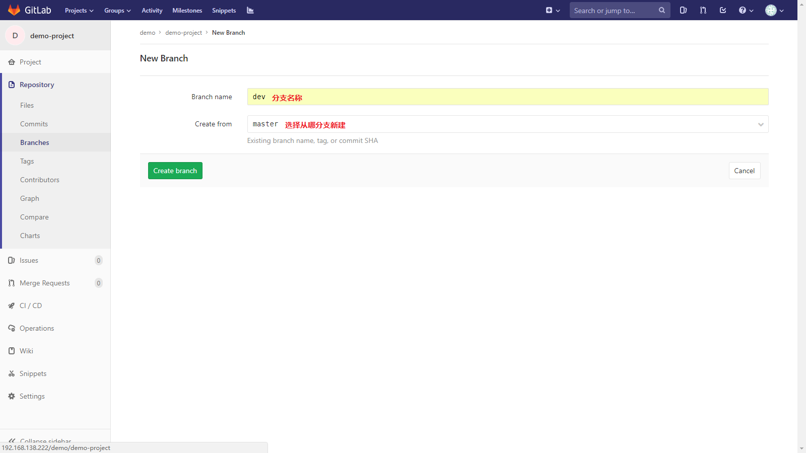

# Gitlab与Git简要教程

## 一、Git命令手册

这里只是列出常用的命令及其解释，详细的git教程建议查看[廖雪峰官方Git教程](https://www.liaoxuefeng.com/wiki/0013739516305929606dd18361248578c67b8067c8c017b000)
>- git init : 把当前目录变成Git仓库
>- git add < filename > ：把文件添加到仓库，可反复多次使用，添加多个文件
>- git commit -m "注释信息" : 把文件提交到仓库
>- git status : 查看当前仓库状态
>- git diff : 查看修改内容
>- git log : 显示从近到远的提交的日志
>- git log --pretty=oneline : 以简洁的样式显示提交的日志
>- git reset --hard commit_id : 回退到指定的版本
>- git reflog : 显示你的每一次命令
>- git reset HEAD < file > : 把暂存区的修改撤销掉，重放到工作区
>- git checkout < file > : 丢到工作区的修改
     - 一种情况：自修改后还没放到暂存区，撤销修改回退到和版本库一摸一样的状态
     - 一种情况：已经添加到暂存区，又作了修改，撤销修改就回到暂存区的状态 
     - git checkout 其实是用版本库里的版本替换工作去的版本
>- git rm < file > ：删除指定文件，并且需要 git commit 
>- git remote add origin git@server-name:path/repo-name.git ：将本地仓库与远程仓库关联，origin为远程仓库起的名称，可以自定
>- git push -u origin master : 第一次推送，把本地master分支内容推送到远程master分支，参数 -u: 将本地master分支和远程的master分支关联
>- git push origin master: 非首次推送，将本地master分支推送到origin远程库中
>- git clone < url > : 克隆远程仓库到本地
>- git branch dev : 创建dev分支
>- git branch dev origin/dev : 创建本地dev分支，并与origin远程库的dev分支关联
>- git branch --set-upstream branch-name origin/branch-name : 建立本地分支和远程分支的关联
>- git checkout dev : 切换到dev分支
>- git checkout -b dev : 创建并切换到dev
>- git checkout -b branch-name origin/branch-nam : 在本地创建和远程分支对应的分支
>- git branch : 查看所有分支，当前分支前标有*号
>- git merge dev : 把dev分支合并到当前分支
>- git branch -d dev : 删除dev分支
>- git branch -D < name > : 强行删除分支
>- git log --graph ：查看分支合并图
>- git stash : 把当前工作区“储藏”起来，等以后恢复继续工作
>- git stash list : 查看暂存起来的工作区
>- git stash apply < 标识 > ：恢复指定暂存的工作区
>- git stash dorp : 删除暂存起来的工作区
>- git stash pop : 恢复的同时删除
>- git remote : 查看远程库的信息
>- git remote -v : 查看远程库的详细信息
>- git pull : 将关联的远程库最新内容抓取到本地
>- git branch --set-upstream-to=origin/< branch > dev ：将本地dev分支与远程origin/< branch >关联
>- git tag < name > : 在当前位置创建标签
>- git tag : 查看所有标签
>- git tag < name > < commit_id > : 在指定提交处常见标签
>- git tag -a < tagname > -m < messgae > < commit_id > : 创建标签时指定说明信息
>- git show < tagname > : 查看标签信息
>- git tag -d < tagname > : 删除标签
>- git push origin < tagname > : 推送标签到远程
>- git push origin --tags : 一次行推送全部尚未推送到远程的本地标签
>- git push origin :refs/tags/< tagname > : 删除一个远程标签

------
#
## 二、Gitlab使用
详细Gitlab教程建议查看[易百教程-Gitlab教程](https://www.yiibai.com/gitlab)
### 1、设置SSH Keys
  用户登录后首先要设置SSH Keys，否则无法pull和push 
  * 点击右上角用户头像——>Settings，选择左边菜单SSH Keys 
  
  
  * 在桌面右击打开Git Bash，输入：ssh-keygen.exe -t rsa -C "youremail@example.com" 直接回车，就会在C盘的用户目录下生成 .ssh
  文件夹，复制文件id_rsa.pub中内容到上图的文本框中，然后点击Add key。 
  
  
### 2、Group管理

#### 2.1、新建组
 
  点击上边导航栏Groups --> You groups ----> New group   
    
  填入Group name和Group的描述，选择组的可见级别（Visibility level）,点击Create group.
#####组的可见级别:
> Private: 组和它的项目只对它的成员可见。 
> Internal: 任何登录用户都可以查看组和任何内部项目。 
> Public: 群组和任何公共项目都可以在没有任何身份验证的情况下查看  
#### 2.2、为组添加成员

  点击上边导航栏Groups ----> You groups ----> 选择要管理的组 ----> 选择左边菜单Members
    
  选择要添加的用户，选择权限，设置过期时间。
#####权限说明：
> Guest:访客 
> Reporter: 报告者 - 可以理解为测试员、产品经理等，一般负责提交issue等。 
> Developer: 开发者 - 负责开发 
> Master: 主人 - 一般是组长，负责对Mater分支进行维护。 
> Owner: 拥有者 - 一般是项目经理 

#### 2.3、为组创建项目
   进入组管理界面 ----> Overview - Details ----> New project
 
  填入项目名称，项目描述，可见级别，点击Create project，如下图所示：
 
 
这样就建立了一个空的项目，也可以使用模板或导入一个项目，在New project页面选择Create from template 或 Import project来创建。
空的项目是没有分支的，可以点击Add README为项目添加readme.md，会默认新建一个master分支。
 
### 3、Project管理
#### 3.1、分支管理
##### 3.1.1 新建分支
  如下图所示在点击项目名称后边的加号，选择New branch，或者在左边菜单栏 Repository > Branches > New branch；
  
  
  填入Branch name，选择Create from（从哪个分支拉取）
  
##### 3.1.2 分支设置
  * 修改默认分支
    - 设置该项目默认分支，除非您指定了一个不同的分支，否则所有的合并请求和提交都将自动针对这个分支执行。

  项目 -> Settings -> Repository 找到Default Branch 点击右侧Expand，选择要设置的默认分支，Save changes
  
  
  * **设置保护分支**
     - 保证分支稳定和安全，迫使开发者使用合并请求（merge request）
   
  
 > **默认保护分支被设计为：**
 > - 如果它没有被创建，除了Maintainer外，阻止它们被创建
 > - 除了Maintainer外，阻止所有人push
 > - 除了Maintainer外，阻止任何人强行push到该分支
 > - 除了Maintainer外，阻止任何人删除该分支
 
 如下图所示进行设置
 
#### 3.2 克隆远程仓库到本地
  找一个空的文件夹，按鼠标右键，选择Git Bash here，打开git的命令窗口。
 

输入
> git clone git@gitlab.test.com:demo/demo-project.git

git clone后面的内容可以在Project > Details页面 点击项目名称右侧clone，选择Clone with SSH 就是了。
其中gitlab.test.com需要换成对应的IP，因为无法解析到地址。
 如果成功就会在当前文件夹下新建一个名为项目名称的文件夹，此文件夹就是克隆的本地仓库，默认拉取的是远程设置的默认分支。

 **Gitlab工具中还有很多内容尚未了解，还需继续学习**
 

