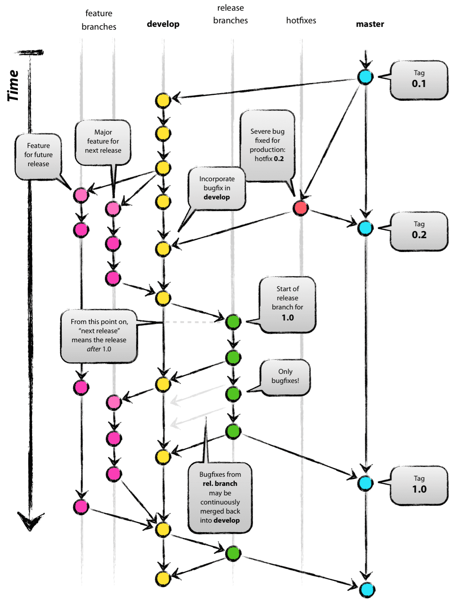

#Gitlab项目管理实践 
######内容摘抄自[前端小菜001](https://www.cnblogs.com/wangrenmeng/p/9774038.html)
#### 1、群组 / 项目
- 群组和项目的关系我们可以简单的理解成文件夹和文件的关系。一个群组可以包含一个或多个项目。  
- 使用群组，可以将相关的项目组合在一起，并允许成员同时访问多个项目。  
- 群组也可以嵌套在子组中，建议最多嵌套一层。  
- 项目的命名我们建议前缀组的名称。  
- 项目的所属关系可以转移

#### 2、可见级别
- 创建群组或者创建项目时，需要设置可见级别，默认为 Internal。有三种级别可选：
    - 1.private。只有项目成员访问才允许访问该项目。必须明确给每一个用户授权访问。
    - 2.Internal。任何已登录的用户均可以访问该项目。
    - 3.public。任何人都可以访问该项目，无论是否登录。
- 对于安全类的项目，应该保证知道的人越少越好，Group 和 Project 的访问级别均应该设置为 Private。
- 对于模板和纯技术类项目，应该设置为 public 或者 internal。
- 还有一类项目，希望所有人知道它的存在，可以浏览，可以搜索，但是不希望所有人都能够获取它的代码。那我们可以这样来设置：
  - 项目的访问级别是 Internal。
  - 项目的（Settings（设置） -> General（常规） -> Permissions（权限） -> Repository（仓库）） 权限设置为： Only Project Members。

#### 3、权限
GitLab 的权限分为群组和项目权限。项目的默认权限继承群组的权限。GitLab有一下五种身份设置，不同的身份分别具有不同的操作权限  
1.所有者。  
2.主程序员。  
3.开发人员。  
4.报告者。  
5.访客。  

[群组权限设置](https://docs.gitlab.com/ee/user/permissions.html#group-members-permissions)  
[项目权限设置](https://docs.gitlab.com/ee/user/permissions.html#project-members-permissions)     
　因为项目的权限设置是继承组的权限，如果组的权限不合理，可以进一步更改。

#### 4、Git实践-分支管理  
  

#### 4.1 主分支 

　　在版本控制系统中有两个永久存在的分支，即master分支和dev分支。
    
　　我们认为远程的master分支上HEAD指向的代码都是可发布的。而远程dev分支上HEAD指向的代码总是反应了下一个版本所要添加功能的最新的代码变更。  
  
　　当dev分支上的代码达到一个稳定状态，准备发布时，所有代码的变更都应合并到master分支，然后打上发布版本号的tag。所以，每次代码合并到master分支时，它既是一个人为定义的新的发布产品。

#### 4.2 辅助分支
  　　为帮助团队成员间的并行开发，功能的简单跟踪，产品的发布准备事宜，以及快速的解决线上问题，我们会采用另外一种辅助性的分支，这些辅助性分支往往只有有限的生命周期，因为他们最终会被删除。辅助分支有几种不同的类型

##### 4.2.1 功能分支

　　用于开发未来某个版本新的功能。只要功能还在开发，它就应该一直存在。功能分支可以从主要分支建立，也可以并行与主要分支建立，但是最终必须合并到主要分支中。功能分支可以随意命名，但是除了master，dev，release，hotfix外。

　　功能分支只存在于开发者的本地版本库。 

##### 4.2.2 release分支

　　从dev分支去建立release分支，release分支必须合并到dev分支和master分支。

　　release分支用于支持一个新版本的发布。在release分支创建好后，就会获取到一个决定好的即将发布的版本号。在此之前，dev分支的代码反应出了下一个版本的代码变更

　　当release分支的准备成为一个真正的发布版本时，我们必须将release分支合并回master分支（因为master分支的每一次提交都是预先定义好的一个新版本），然后为这次提交打tag，为将来查看历史版本做准备。最后将在release分支做得更改也合并到dev分支，这样的作用是使将来的其他版本也会包含这些已经解决了的Bug。

##### 4.2.3 Hotfix分支

　　Hotfix分支从master分支进行创建。最后必须合并回dev分支和master分支。

　　Hotfix分支在某种程度上非常像release分支，他们都是为新版本发布做准备。Hotfix分支是基于当前生产环境的产品的一个Bug急需解决而创建的。当某个版本的产品有一个严重Bug需要立即解决，Hotfix分支需要从master分支上该版本对应的tag上进行建立，因为这个tag标记了产品的版本。

　　完成工作之后，解决掉的bug代码需要合并回master分支，同时也需要合并到dev分支，目的是保证在下一版本中该Bug已经被解决。

　　上述的每一个分支都有其特殊目的，也绑定了严格的规则：哪些分支是自己的拉取分支，哪些分支是自己的目标合并分支。从技术角度看，这些分支的特殊性没有更多的含义。只是按照我们的使用方式对这些分支进行了归类。他们依旧是原Git分支的样子。
####4.3 commits / push

　　工作中我们每天最少一次推送，而每次修改都可以作为一次提交。

#### 4.4 合并请求

　　合并请求是GitLab作为代码协作和版本控制平台的基础。顾名思义：一个请求，以合并一个分支到另一个分支。

　　合并申请功能来通知团队成员你已经完成了可一个功能开发。当开发者完成开发的功能后，然后发起合并申请。这可以让被通知到人去review代码并合并这些代码到master分支不过合并申请功能可不止发送通知这么简单——它可以用来作为讨论提出申请的功能的专用论坛。如果代码有任何问题，团队成员们可以提出反馈，甚至推送（push）提交来小小的修改代码。合并申请功能可以追踪这些事情。

　　请求合并的基本流程大致如下：

　　开发者在本地仓库创建一个功能开发专用的分支。

　　开发者将分支推送到远程仓库

　　开发者发起合并申请

　　团队成员review代码，展开讨论或者修改他们。

　　项目维护者合并该分支到正式仓库然后关闭合并申请。

####4.5 敏捷开发

　　GitLab是敏捷开发的一个高效实践工具，而且在不断的发展和迭代。其作用主要体现在以下两个功能中

##### 4.5.1 issues　

　　GitLab对issues的介绍是：issues是添加需要在项目中改进或解决的事物的地方。可能是要讨论的错误，任务或想法。issues是可搜索和可过滤的。

　　issues可以是一个Bug，可以是一个功能，可以用开发布任务，需求调研或者是某个类或者函数的重构。

　　强烈建议跟项目有关系的事情，不要放在脑子里，放在issues中。而我们每天上班的第一件事就是看issues，了解项目相关的问题。

##### 4.5.2 里程碑

　　里程碑规定项目的任务清单，任务的开始时间和结束时间。可以多个里程碑并行。

　　里程碑是项目整体进度的体现。项目经理通过关注里程碑的规划，进度对项目进行相应的调整。